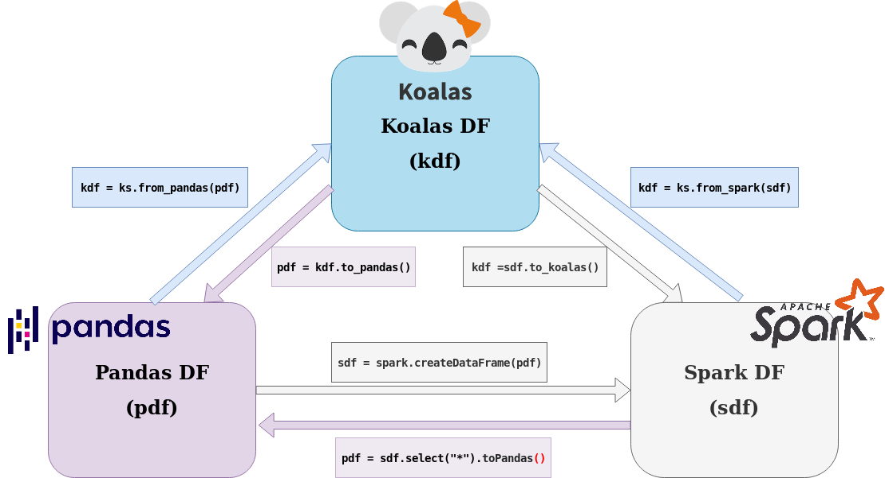
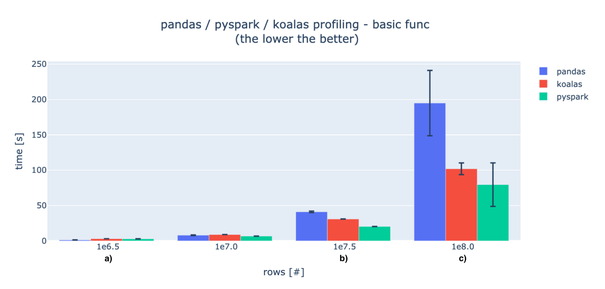
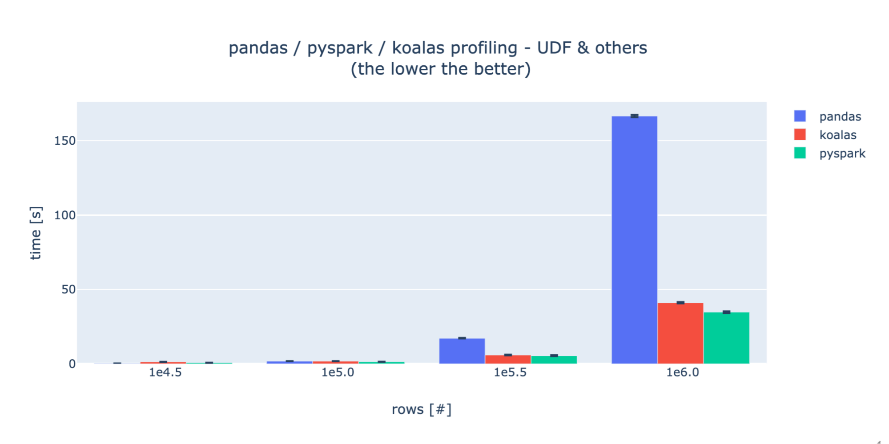

<div style="text-align: center; line-height: 0; padding-top: 9px;">
  
</div>

## __Koalas the New open source Pandas API - Notebook Example__

#### By the end of this Tutorial you will be able to install, use and master Databricks Koalas! 

### __Steps shown in this Notebook:__
* #### Koalas Introduction.
* #### Koalas Installation.
* #### Koalas,Spark and Pandas How it works between each other?.
* #### Pandas, Spark and Koalas performance test
* #### Koalas - Example 1 : From Pandas to koalas Example
* #### Koalas - Example 2 : From Pyspark to Koalas Example
* #### Koalas - Example 3 : Transforming Data for Features Engineering
* #### __Bonus : Optimization with Apache Arrow__


## __Koalas Introduction__ 

> The Koalas project makes data scientists more productive when interacting with big data, by implementing the pandas DataFrame API on top of Apache Spark.
>
> pandas is the facto standard (single-node) DataFrame implementation in Python, while Spark is the facto standard for big data processing. With this package, you can:
>
>    - Be immediately productive with Spark, with no learning curve, if you are already familiar with pandas
>    - Have a single codebase that works both with pandas (tests, smaller datasets) and
> with Spark (distributed datasets).
#### SOURCE : https://koalas.readthedocs.io/en/latest/index.html

___

## __Koalas Installation__ 

#### The recommended way of installing Koalas is Conda as below.

```sh 
$ conda install koalas -c conda-forge
```

#### The alternative way to install koalas is Pypi

```sh 
$ pip install koalas==0.31.0
```

#### till the date when this post was written; the lastest release is 0.31.0 - for newest release please check https://pypi.org/project/koalas/0.31.0/

## __Pandas, Spark and Koalas what is under the hood__

<div style="text-align: center; line-height: 0; padding-top: 9px;">
  
</div>

#### Let's digg a little bit deeper into the transformations between this trees Dataframes, and how we can take advantage from each one.
#### Pandas dataframes are in-memory, `single-server`. So their size is limited by a single server memory. However Spark dataframes are distributed on spark cluster which contains driver and multi-worker nodes (in general case), so the dataframes size is limited by the size of the cluster. If we need to handle more data, we just need to add more nodes in the cluster, and this refer to the : `spark scalablity side`.
#### For Koalas is designed to be the bridge between Pandas DataFrame and Spark DataFrame, and it combine the benefits of both pandas and pyspark dfs


## __Pandas, Spark and Koalas performance test__

#### Basic Functions 

<div> style="text-align: center; line-height: 0; padding-top: 9px;">
  
</di>

#### UDF

<div> style="text-align: center; line-height: 0; padding-top: 9px;">
  
</di>

source : https://databricks.com/blog/2019/08/22/guest-blog-how-virgin-hyperloop-one-reduced-processing-time-from-hours-to-minutes-with-koalas.html

## __Koalas - Example 1 : From Pandas to koalas example__ 
```python
import pandas as pd
pd_df = pd.read_csv("../data/titanic_data.csv")
pd_df.head(5)
```
## Convert Pandas into Koalas 
```python
import databricks.koalas as ks
ks_df = ks.from_pandas(pd_df)
ks_df.head(5)
```
## __Koalas - Example 2 : From spark to koalas example__ 

### Note : If you are using python, You run this cell to create spark context
```python
from pyspark import SparkContext
try:
    sc = SparkContext('local', 'Koalas_demo')
except ValueError:
    print('SparkContext already exists!')
    from pyspark.sql import SparkSession
try:
    spark = SparkSession.builder.appName('Koalas_demo').getOrCreate()
except ValueError:
    print('SparkSession already exists!')
```
```python
s_df = spark.read.csv("../data/titanic_data.csv", header = True, inferSchema= True)
s_df.show(5)

s_df.printSchema()
```
## Handling None value exemple with spark 
```python
import pyspark.sql.functions as f
s_df_clean = s_df.where(f.col("Age").isNotNull())

s_df_clean.show(5)
```
#### Let's change spark dataframe to koalas dataframe
```python
ks_df = s_df.to_koalas()
```
## Handling None value exemple with Koalas 
```python
ks_df_clean = ks_df[~ks_df['Age'].isnull()]

ks_df_clean.head(5)
```
## __Koalas - Example 3 : Transforming Data for Features Engineering__

### __1 Understanding DataFrame Schema__ 

# DataFrame column names
```python
pd_cols = pd_df.columns
s_cols = s_df.columns
ks_cols = ks_df.columns
```

# DataFrame column data type
```python
pd_types = pd_df.dtypes
s_types = s_df.dtypes
ks_types = ks_df.dtypes
```
### __2 Grouping By and Aggregation__ 

####  __Pandas__ :
```python
pd_df.groupby('Embarked').max()['Age']
```
####  __Koalas__ :
```python
ks_df.groupby('Embarked').max()['Age']
```
#### __Spark (pyspark)__ :

#### in spark DataFrame the group by and aggregation has a different format 
```python
s_df.groupBy("Embarked").agg(f.max("Age")).show()
```
### __3 Cleaning Data__ 

####  __Pandas__ :
```python
pd_df_clean = pd_df[~pd_df['Age'].isnull()]
```
####  __Koalas__ :
```python
ks_df_clean = ks_df[~ks_df['Age'].isnull()]
```
#### __Spark (pyspark)__ :
```python
s_df_clean = s_df.where(f.col("Age").isNotNull())
```
### __4 Filtering Data__ 

####  __Pandas__ :
```python
pd_df.loc[pd_df['Age'] >= 45, ['Survived','Pclass']].head()
```
####  __Koalas__ :
```python
ks_df.loc[ks_df['Age'] >= 45, ['Survived','Pclass']].head()
```
#### __Spark (pyspark)__ :
```python
s_df.filter("Age >= 45").select("Survived","Pclass").show(5)
```
### __5 Selecting columns__ 

#### __Pandas__ :
```python
pd_df[['Pclass', 'Cabin']].head()
```
#### __Koalas__ :
```python
ks_df[['Name', 'Cabin']].head()
```
#### __Spark (pyspark)__ :
```python
s_df.select('Pclass', 'Cabin').show(5)
```
### __6 Dropping Columns__ 

#### __Pandas__ :
```python
pd_df.drop(['Name', 'PassengerId'], axis=1).head(3)
```
#### __Koalas__ :
```python
pd_df.drop(['Name', 'PassengerId'], axis=1).head(3)
```
#### __Spark (pyspark)__ :
```python
s_df.drop('Name', 'PassengerId').show(3)
```
## __Bonus 🎉  : Optimization with Apache Arrow__

#### for the optimization of Pandas Koalas conversion, Apache Arrow, which is an intermediate columnar storage format, that helps in faster data transfer. [reading more about Apache Arrow](https://arrow.apache.org/).


### installing Apache Arrow

```sh
$ pip install pyarrow
```

### let's test 3 options with %%timeit:
* #### 1st one : converting pandas df to koalas without Arrow intermediation 
* #### 2nd one : converting pandas df to koalas with the implicit Apache Arrow intermediation 
* #### 3rd one : converting pandas df to koalas with explicite Apache Arrow intermediation 


##### __Note : The test will be done by using 1.5 Millions row dataSet__  [dataset source](http://eforexcel.com/wp/downloads-18-sample-csv-files-data-sets-for-testing-sales/).

#### __converting pandas df into koalas without Arrow intermidiation__
```python
%%timeit
spark.conf.set("spark.sql.execution.arrow.enabled", False)
pd_df_ = pd.read_csv("../data/1500000_Sales_Records.zip", header=0, sep=',')
ks_df_ = ks.from_pandas(pd_df_)
```
output : __23.5 s ± 255 ms per loop (mean ± std. dev. of 7 runs, 1 loop each)__
#### __converting pandas df into koalas with the implicit Apache Arrow intermidiation__
```python
%%timeit
spark.conf.set("spark.sql.execution.arrow.enabled", True)
pd_df_ = pd.read_csv("../data/1500000_Sales_Records.zip", header=0, sep=',')
ks_df_ = ks.from_pandas(pd_df_)
```
output : __6.18 s ± 52.4 ms per loop (mean ± std. dev. of 7 runs, 1 loop each)__
#### __converting pandas df into koalas with the Explicit Apache Arrow intermidiation__
```python
%%timeit
from pyarrow import csv  ## csv will be used to read zipped csv file
spark.conf.set("spark.sql.execution.arrow.enabled", True)
arrow_table = csv.read_csv("../data/1500000_Sales_Records.zip", header=0, sep=',')
ks_df_ = ks.from_pandas(arrow_table.to_pandas())
```
output : __4.04 s ± 39.5 ms per loop (mean ± std. dev. of 7 runs, 1 loop each)__


## __Conclusion__ 

#### Simply, Koalas is a Python package that is similar to Pandas. It performs computation with Spark. (as simple as that 😋)

# __Materials and Resources :__  📖 

#### __Used Dataset__ : https://jkarakas.github.io/Exploratory-Analysis-of-the-Titanic-Dataset/Titanic_Dataset_Exploratory_Analysis._With_Code.html
####  __About koalas__ : https://koalas.readthedocs.io/en/latest/user_guide/best_practices.html#leverage-pyspark-apis
####  __About Apache Arrow__ :https://arrow.apache.org/
####  __About Databricks Koalas GitHub__ :  https://github.com/databricks/koalas
